# Workstream Export

Export workstream data in various formats.

## Description

This command exports the workstream registry to different formats for visualization, documentation, or backward compatibility purposes.

## Usage

```
/workstream-export [--format <format>] [--output <file>] [--filter <state>]
```

### Arguments

| Argument | Required | Default | Description |
|----------|----------|---------|-------------|
| `--format` | No | todos | Output format: todos, mermaid, json, markdown |
| `--output` | No | stdout | Write to file instead of displaying |
| `--filter` | No | all | Filter by state |

## Formats

### TODOs Format (`--format todos`)

Generates a TODOs.txt-compatible format:

```
# Workstream Export - 2026-01-18
# Generated from .swarm/workstreams.json
#
# Use /workstream-status for the authoritative view

## In Progress
- [ ] cli-integration-architecture: CLI Integration Architecture [P1]
  - Phase 2/5 in progress
- [ ] player-faction-tracking: Player/Faction Tracking [P1]
  - Phase 3/3 in progress

## Ready
- [ ] production-queue: Production Queue System [P2]
- [ ] city-system: City System [P2]
- [ ] combat-system: Combat System [P2]
- [ ] hover-highlight-bug-fix: Hover Highlight Bug Fix [P3]

## Ideas
- [ ] resources-visible-bug: Resources Not Visible [P3]
- [ ] victory-conditions: Victory Conditions [P2]
  - Blocked by: player-faction-tracking
- [ ] server-client-architecture: Server-Client Architecture [P4]

## Research
- [ ] solo-worktree-improvements: Solo Worktree Improvements [P3]

## Completed (Today)
- [x] notification-system: Notification System [P2]
```

### Mermaid Format (`--format mermaid`)

Generates a Mermaid dependency graph:

```mermaid
graph TD
    subgraph implementing
        cli-integration-architecture["CLI Integration Architecture<br/>P1 - Phase 2/5"]
        player-faction-tracking["Player/Faction Tracking<br/>P1 - Phase 3/3"]
    end

    subgraph ready
        production-queue["Production Queue<br/>P2"]
        city-system["City System<br/>P2"]
        combat-system["Combat System<br/>P2"]
        hover-highlight-bug-fix["Hover Highlight Bug<br/>P3"]
    end

    subgraph idea
        resources-visible-bug["Resources Bug<br/>P3"]
        victory-conditions["Victory Conditions<br/>P2"]
        server-client-architecture["Server-Client Arch<br/>P4"]
    end

    subgraph merged
        notification-system["Notification System<br/>P2 ✓"]
    end

    %% Dependencies
    victory-conditions -->|blocks| player-faction-tracking
    server-client-architecture -.->|informs| cli-integration-architecture

    %% Phases
    cli-integration-architecture --> cli-integration-architecture/phase-2
    cli-integration-architecture --> cli-integration-architecture/phase-3
```



### JSON Format (`--format json`)

Exports the raw registry (optionally filtered):

```json
{
  "exportedAt": "2026-01-18T22:00:00Z",
  "filter": "all",
  "workstreams": [
    {
      "id": "cli-integration-architecture",
      "title": "CLI Integration Architecture",
      "state": "implementing",
      "priority": 1,
      ...
    }
  ]
}
```

### Markdown Format (`--format markdown`)

Generates a documentation-friendly format:

```markdown
# Workstream Status Report

**Generated**: 2026-01-18 22:00

## Summary

| State | Count |
|-------|-------|
| Implementing | 2 |
| Ready | 4 |
| Idea | 3 |
| Research | 1 |
| Merged | 1 |
| **Total** | **11** |

## In Progress

### CLI Integration Architecture
- **ID**: cli-integration-architecture
- **Priority**: P1
- **State**: implementing
- **Progress**: Phase 2 of 5
- **Plan**: [View Plan](.swarm/plans/2026-01-18-cli-integration-architecture.md)

### Player/Faction Tracking
- **ID**: player-faction-tracking
- **Priority**: P1
- **State**: implementing
- **Progress**: Phase 3 of 3
- **Plan**: [View Plan](.swarm/plans/2026-01-18-player-faction-tracking.md)

## Ready to Start

### Production Queue System
- **ID**: production-queue
- **Priority**: P2
- **Blockers**: None
- **Plan**: [View Plan](.swarm/plans/2026-01-18-production-queue.md)

...

## Dependency Graph

```mermaid
<embedded mermaid graph>
```

## Recently Completed

| Workstream | Merged At |
|------------|-----------|
| notification-system | 2026-01-18 22:00 |
```

## Execution

### Step 1: Load Registry

```bash
cat .swarm/workstreams.json
```

### Step 2: Apply Filter

If `--filter` specified, filter workstreams:

```javascript
const filtered = Object.values(registry.workstreams).filter(ws => {
  if (filter === 'all') return true;
  return ws.state === filter;
});
```

### Step 3: Generate Output

Based on `--format`, generate the appropriate output.

### Step 4: Write Output

If `--output` specified, write to file:

```bash
echo "$output" > "$output_file"
```

Otherwise, display to stdout.

## Examples

### Generate TODOs.txt

```
/workstream-export --format todos --output TODOs-export.txt
```

### View Dependency Graph

```
/workstream-export --format mermaid
```

Copy the output to a Mermaid viewer or GitHub README.

### Export Ready Workstreams

```
/workstream-export --format json --filter ready
```

### Generate Status Report

```
/workstream-export --format markdown --output STATUS.md
```

## Error Handling

### Empty Registry

```
Warning: No workstreams found in registry.

Nothing to export.

Use /workstream-add to add workstreams, or
Use /workstream-import to migrate from TODOs.txt.
```

### Invalid Filter

```
Error: Invalid filter 'invalid-state'.

Valid filters:
  - all (default)
  - idea
  - research
  - planning
  - ready
  - implementing
  - merged
```

### Write Error

```
Error: Could not write to output file.

Path: /readonly/path/export.txt
Error: Permission denied

Export displayed below instead:
<export content>
```

## Input

$ARGUMENTS

## Notes

- TODOs format is for backward compatibility with existing workflows
- Mermaid format requires a Mermaid renderer (GitHub, VS Code, etc.)
- JSON format preserves all workstream data
- Markdown format is suitable for documentation or reports
- Export does not modify the registry (read-only operation)
